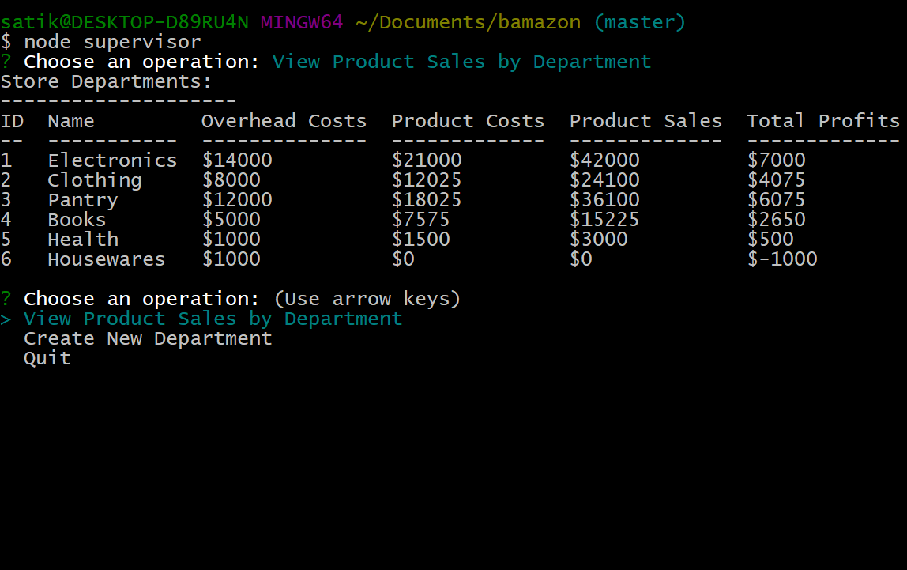

### bamazon

There are three components to this application:

* customer
* manager
* supervisor

##### customer

To run the customer part, enter this in the console:
```
node customer
```

It will show the products currently for sale, then prompt for what item to buy and how many units.  Both fields must be integers.  After the user enters integers for the fields, the program will check if the product is stocked by the store and if there is enough in stock.  If both are true, it will fill the order.  Otherwise, the user will be shown a message.  

A demonstration of this program is below:


##### manager

To run the manager part, enter this in the console:
```
node manager
```

It will show the options available to the manager:
* View Products for Sale
* View Low Inventory
* Add to Inventory
* Add New Product
* Quit

After every operation, until the user quits, it will return to this menu.

###### View Products for Sale

This lists the products currently for sale, showing all the item information: ID, name, dept. name, cost, price, # items in stock


###### View Low Inventory

This lists the products that have less than a threshold number of items in stock.  In this case, the threshold is 5.


###### Add to Inventory

The manager will be prompted for an item number and a number of units to add to stock.  Both numbers must be integers.  If the item number is in the inventory, the number of units will be added to stock.  Otherwise, the user will see a message.

A demonstration of adding stock and proof of the added stock is below:


###### Add New Product

The manager will be prompted for the following information:
* The product name
* Department (selected from a list)
* Initial # of units in stock (must be an integer)
* Item cost to store (must be a number)
* Item price for customer (must be a number)

A demonstration of adding a new product and proof of the added product is below:


##### supervisor

To run the supervisor part, enter this in the console:
```
node supervisor
```

It will show the options available to the supervisor:
* View Product Sales by Department
* Create New Department
* Quit

After every operation, until the user quits, it will return to this menu.

###### View Product Sales by Department

This lists the departments in the store, with the following information per department:
* Product Sales
* Product Costs
* Overhead Costs
* Total Profit (Product Sales - Product Costs - Overhead Costs)


###### Create New Department

The supervisor will be prompted for the following information:
* The department name
* Overhead costs (must be an integer)

A demonstration of adding a new department and proof of the added department is below:

